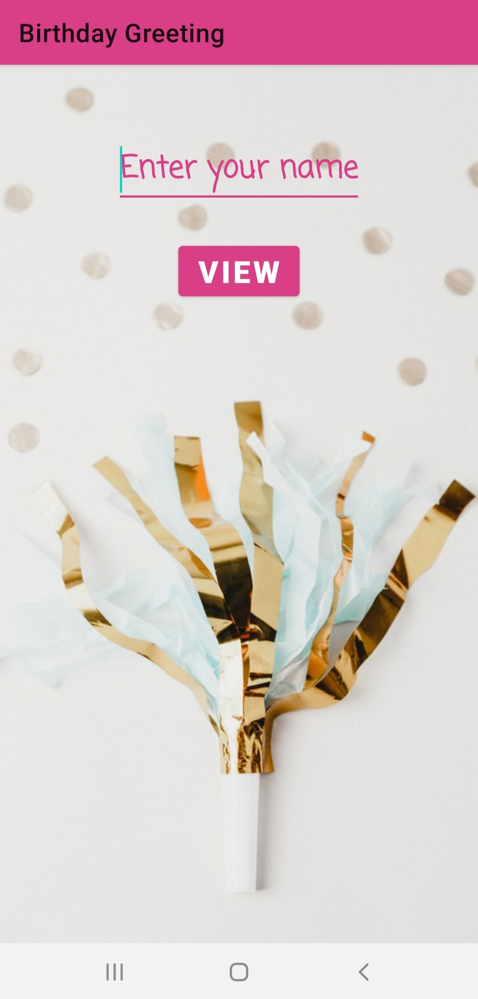
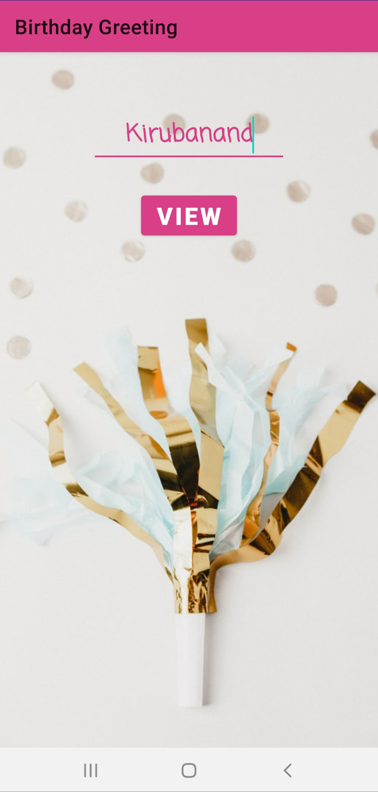

# Birthday-Greeting
A simple app using TextViews, EditTexts, ImageViews, Buttons, and basics of Intents to get the name of the user and wish him "Happy Birthday".

## Screenshots of the App
<table>
  <tr>
    <td>  </td>
    <td>  </td>
    <td>  </td>
  </tr>
</table>
